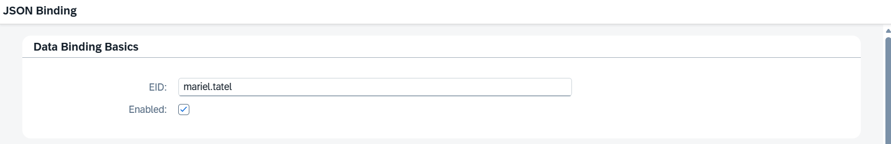
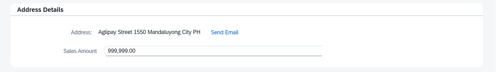
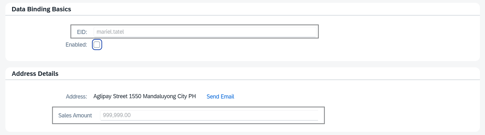
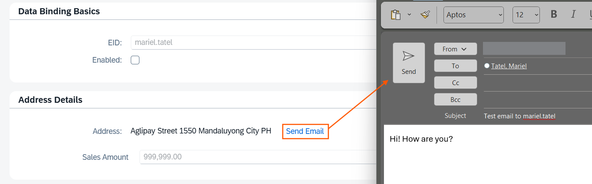
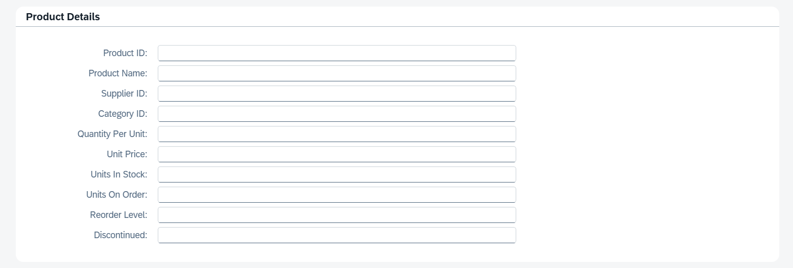
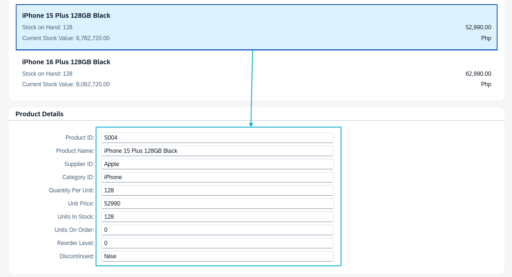

# [SAP Fiori Capability] SAPUI5 Basic Training
## DAY 5 - JSON Binding Activity Output

### Data Binding Basics Panel with Simple Form

### Address Details Panel with Simple Form

* Unchecking the Enabled checkbox will make those fields with enabled property become disabled.
    
    *EID and Sales Amount input field are disabled since they used the enabled property.*

  

* Clicking the Send Email in the Address Details Panel will open a draft email in Outlook
    
    *Send Email link opens an email draft with specified Email recipient, subject, and body.*

---

### Aggregation Binding Panel with List View

### Product Details Panel with Simple Form

* Product Details Panel displays the details of the selected item in the List View
    
    *Product Details panel displays the details of product with Product ID = 'S004' as it is selected in the List View.*